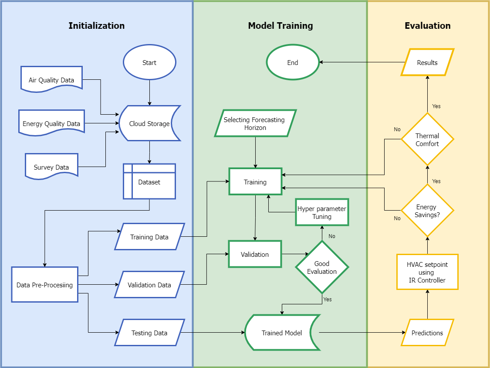
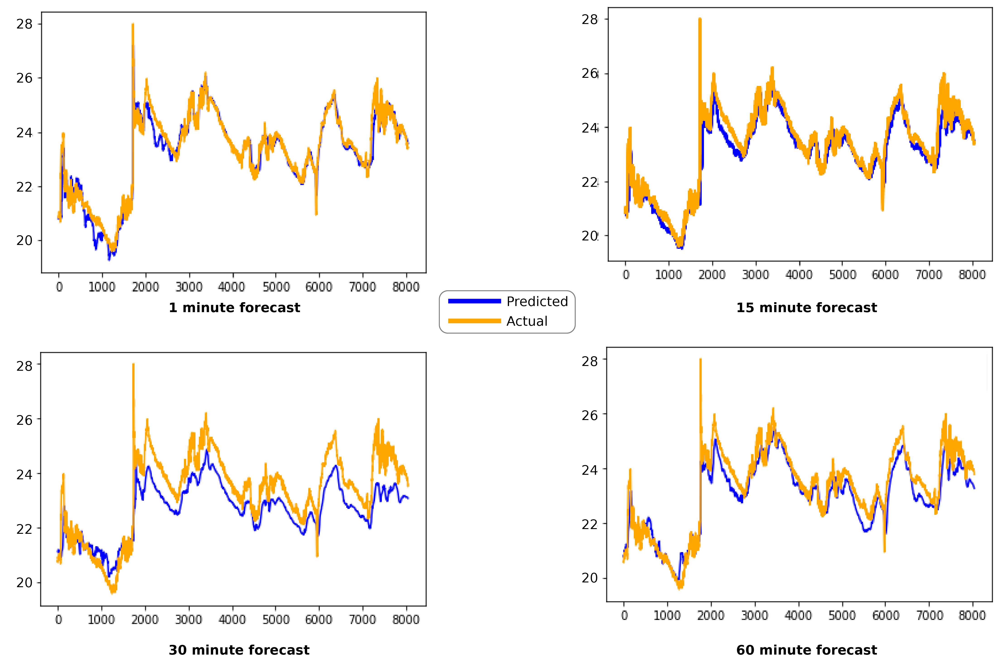

# HVAC Transformer-MPC: Building Energy & Indoor Environmental Quality Forecasting

[](https://colab.research.google.com/drive/1grAelzrOW6c0FLXvb-b-dvd3-CCuzI7m#scrollTo=biwzdDbNjhjp)

This repository provides an implementation of a **Transformer-based Deep Learning** architecture for indoor temperature prediction and HVAC energy optimization, following the methodology established by Faiz et al.

---

## 📋 Methodology Overview
The project follows a structured pipeline from data initialization to real-time evaluation for model predictive control.


*Figure 1: System architecture encompassing Data Initialization, Model Training, and Evaluation phases.*

---

## 📊 Key Experimental Results (Faiz et al., 2023)
The following results highlight the efficiency of the Transformer-based Model Predictive Control (MPC) framework in real-world building management scenarios:

### 1. Energy Efficiency
* **50.98% Energy Reduction:** HVAC energy consumption was reduced from **42.34 kWh** (baseline) to **20.75 kWh**.
* **Cost Optimization:** Significant decrease in operational expenses while maintaining strict indoor environmental quality (IEQ) standards.

### 2. Multi-Horizon Forecasting Performance
The model demonstrates high accuracy across various forecasting horizons (1, 15, 30, and 60 minutes).


*Figure 2: Comparison between Predicted and Actual values across multiple forecasting horizons.*

### 3. Occupant Comfort & Air Quality
* **Thermal Comfort:** Maintained the Predicted Mean Vote (PMV) within the **-0.5 to +0.5** range (ASHRAE Standard 55).
* **Air Quality:** CO2 levels consistently kept below **800 ppm**.

---

## 🏗️ Model Architecture
The core utilizes a Multi-Head Attention mechanism to capture complex temporal dependencies in environmental sensor data.

| Component | Specification |
| :--- | :--- |
| **Look-back Window** | 60 Minutes |
| **Attention Heads** | 8 |
| **Encoder Blocks** | 4 |
| **Optimizer** | Adam (LR: 0.001) |

---

## 🚀 Getting Started

1. **Clone the Repo:**
   ```bash
   git clone [https://github.com/YOUR_USERNAME/HVAC-Transformer-MPC.git](https://github.com/YOUR_USERNAME/HVAC-Transformer-MPC.git)
   Setup Environment:
   ```

2. **Install dependencies via requirements.txt.**
   Note: For Python 3.12+, set PROTOCOL_BUFFERS_PYTHON_IMPLEMENTATION=python.

3. **Run in Colab:**
   Click the "Open in Colab" badge at the top to start training immediately.

## 🎓 Citation

If you use this work, please cite the original paper:
   ```bash
   @article{FAIZ2023381,
   title = {Energy modeling and predictive control of environmental quality for building energy management using machine learning},
   journal = {Energy for Sustainable Development},
   volume = {74},
   pages = {381-395},
   year = {2023},
   author = {Muhammad Faizan Faiz and Muhammad Sajid and Sara Ali and Kashif Javed and Yasar Ayaz}
   }
```

## 📁 Repository Structure
```bash
├── data/                   # Dataset files (Environmental sensors, HVAC load)
│   └── Sample_Data.csv     # Sample Data from original dataset
├── models/
│   ├── CNN.py              # Main CNN_LSTM class implementation
│   ├── RNN.py              # Main RNN class implementation
│   └── transformers.py     # Main Transformer class implementation
├── LICENSE                 
├── README.md               
├── _main_.py               
├── parameters.json         # Model hyperparameters (Look-back, heads, dropout)
├── requirements.txt        # Python dependencies
├── utils.py                # Custom metrics (sMAPE, RMSE) and data processing

